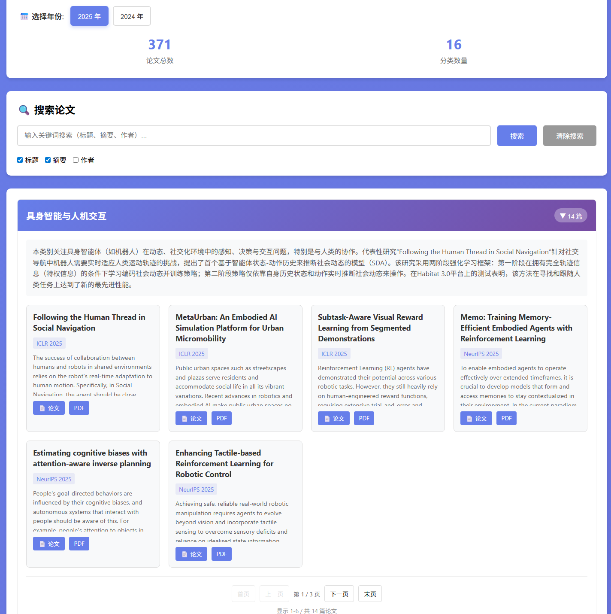

# ICRL・ICML・NeurIPS 智能体强化学习论文整理

[](https://www.python.org/)
[](https://flask.palletsprojects.com/)
[](https://opensource.org/licenses/MIT)


可视化整理 **ICLR / ICML / NeurIPS** 近几年关于**智能体强化学习（Agent RL）**的相关论文，支持多年度数据切换对比查看。

目前支持：**2024 / 2025** 年三大顶会论文



## 功能亮点

- 📅 年份一键切换（2024–2025）
- 🔍 关键词 + 分类双重筛选
- 📊 实时显示论文总数 & 分类统计
- 📱 响应式设计，手机/平板友好
- ⚡ 按需加载数据，切换秒级响应
- 🎨 清爽紫色主题 + 悬停/激活交互反馈


## 快速开始

```bash
# 克隆项目
git clone https://github.com/invinciby/CCF_A_agentRL_PapersRead.git

# 进入目录 & 安装依赖
cd CCF_A_agentRL_PapersRead
pip install -r requirements.txt          # 或直接 pip install flask

# 启动服务
python code/main.py
```

启动后访问： http://127.0.0.1:5000

## 如何添加新年份数据

1. 在 `output/` 目录下新建年份文件夹，例如 `output/2026/`
2. 放入对应格式的分类结果（参考已有年份结构）
3. 重启应用 → 系统会自动识别并加入年份选择器

当前支持的目录结构示例：

```
output/
├── 2025/
│   ├── keyword_20250515_xxxxxx/
│   │   ├── 00_classification_summary.json
│   │   ├── 01_自主决策与规划.json
│   │   ├── 02_多智能体协作.json
│   │   └── ...
├── 2024/
    └── ...

```

## 主要特性说明

| 功能                     | 说明                                              | 状态     |
|--------------------------|---------------------------------------------------|----------|
| 年份切换                 | 顶部大按钮，当前年份紫色高亮                      | ✓ 完成   |
| 切换时自动重置           | 搜索框、分页、展开状态全部重置                    | ✓ 完成   |
| 加载中动画               | 防止用户焦虑                                          | ✓ 完成   |
| 错误提示                 | 数据缺失/格式错误时友好提示                       | ✓ 完成   |
| 响应式布局               | 手机、平板、桌面均可正常使用                      | ✓ 完成   |
| 同时查看多年度对比       | 暂不支持（计划后续加入并排对比模式）              | 🚧 计划   |

## 常见问题 FAQ

**Q：切换年份后搜索记录会保留吗？**  
A：不会，为了防止数据混淆会自动清空搜索框

**Q：我想同时对比两年的论文怎么办？**  
A：目前只能先后切换查看，建议使用两个浏览器窗口或分屏对比

**Q：某个年份没显示出来？**  
A：请检查 `output/年份/` 文件夹是否存在且包含正确的 json 分类文件


## 后续计划（Roadmap）

- [ ] 年度之间论文并排对比视图
- [ ] 论文标题/摘要关键词云
- [ ] 导出 csv / bibtex 功能
- [ ] 论文热度/引用简单统计（需要额外数据源）
- [ ] 深色模式切换

欢迎 PR & Issue！  
希望这份整理能帮助到在 Agent/RL 方向奋斗的大家～ 🚀

**Happy Reading!** 📚✨
